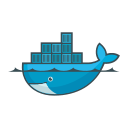
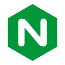
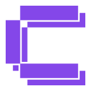
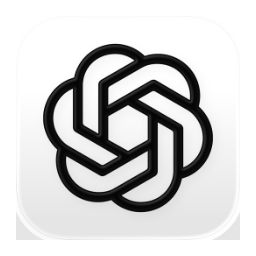

[](https://git.io/typing-svg)

<div align="center">
  <a href="https://www.linkedin.com/in/joao-cruz-j"></a>
  <a href="mailto:joao.victor1020@outlook.com"></a>
  
</div>

---

### `[ ABOUT ME ]`
```yaml
name: João Cruz
role: Automation Engineer
experience: 4 years hands-on in tech
education:
  - BSc Computer Engineering - USJT
  - MBA Data Engineering - FIAP
focus: 
  - Process Automation
  - Data Engineering
  - Applied AI & LLM
```

📝 **My scientific paper:** [AI and Cybersecurity: Analysis of Emerging Threats and Defensive Strategies](https://ojs.revistadelos.com/ojs/index.php/delos/article/view/2954)

---

### `[ PROJECTS ]`

<table>
<tr>
<td width="50%" valign="top">

**Lakehouse**

Multi-tenant data architecture integrating 4 systems (CRM, Meta Ads, Asaas and Conta Azul)


</td>
<td width="50%" valign="top">

**AI Translation**

Sworn translation system PT→IT for legal documents


</td>
</tr>
<tr>
<td valign="bottom">

  &nbsp;<sub>GCP · BigQuery · Terraform · Dataform</sub>

</td>
<td valign="bottom">

   &nbsp;<sub>DeepL API · TypeScript · Docker</sub>

</td>
</tr>
<tr>
<td valign="top">

**AI Feedback**

Agent that analyzes sales conversations and generates automated reports

</td>
<td valign="top">

**Bitrix24 CRM**

End-to-end implementation from scratch to full adoption

</td>
</tr>
<tr>
<td valign="bottom">

   &nbsp;<sub>LangGraph · Python · Docker</sub>

</td>
<td valign="bottom">

 &nbsp;<sub>Bitrix24 · Automations · API</sub>

</td>
</tr>
</table>

---

### `[ INVENTORY ]`

<p align="left">
  <!-- Languages & Frontend -->
  <a href="https://www.python.org/" target="_blank"></a>
  <a href="https://www.typescriptlang.org/" target="_blank"></a>
  <a href="https://developer.mozilla.org/en-US/docs/Web/JavaScript" target="_blank"></a>
  <a href="https://developer.mozilla.org/en-US/docs/Web/HTML" target="_blank"></a>
  <a href="https://developer.mozilla.org/en-US/docs/Web/CSS" target="_blank"></a>
  <a href="https://reactjs.org/" target="_blank"></a>
  <a href="https://nextjs.org/" target="_blank"></a>
  <a href="https://nodejs.org/" target="_blank"></a>
  <a href="https://expressjs.com/" target="_blank"></a>
  <!-- Databases & Storage -->
  <a href="https://www.postgresql.org/" target="_blank"></a>
  <a href="https://www.mysql.com/" target="_blank"></a>
  <a href="https://redis.io/" target="_blank"></a>
  <a href="https://supabase.com/" target="_blank"></a>
  <a href="https://qdrant.tech/" target="_blank"></a>
  <!-- Cloud & Infrastructure -->
  <a href="https://aws.amazon.com/" target="_blank"></a>
  <a href="https://cloud.google.com/" target="_blank"></a>
  <a href="https://www.cloudflare.com/" target="_blank"></a>
  <a href="https://www.docker.com/" target="_blank"></a>
  <a href="https://www.terraform.io/" target="_blank"></a>
  <a href="https://nginx.org/" target="_blank"></a>
  <a href="https://traefik.io/" target="_blank"></a>
  <a href="https://coolify.io/" target="_blank"></a>
  <a href="https://ubuntu.com/" target="_blank"></a>
  <a href="https://www.debian.org/" target="_blank"></a>
  <a href="https://www.hostinger.com/" target="_blank"></a>
  <a href="https://www.godaddy.com/" target="_blank"></a>
  <!-- AI & LLM -->
  <a href="https://www.langchain.com/" target="_blank"></a>
  <a href="https://chatgpt.com/" target="_blank"></a>
  <a href="https://claude.ai/" target="_blank"></a>
  <a href="https://www.deepseek.com/" target="_blank"></a>
  <a href="https://manus.im/" target="_blank"></a>
  <a href="https://modelcontextprotocol.io/" target="_blank"></a>
  <a href="https://www.firecrawl.dev/" target="_blank"></a>
  <a href="https://tavily.com/" target="_blank"></a>
  <a href="https://www.deepl.com/" target="_blank"></a>
  <a href="https://cursor.com/" target="_blank"></a>
  <a href="https://antigravity.google/" target="_blank"></a>
  <a href="https://lovable.dev/" target="_blank"></a>
  <a href="https://huggingface.co/" target="_blank"></a>
  <a href="https://ollama.com/" target="_blank"></a>
  <!-- Automation, Data & Productivity -->
  <a href="https://www.postman.com/" target="_blank"></a>
  <a href="https://github.com/features/actions" target="_blank"></a>
  <a href="https://n8n.io/" target="_blank"></a>
  <a href="https://www.make.com/en" target="_blank"></a>
  <a href="https://streamlit.io/" target="_blank"></a>
  <a href="https://powerbi.microsoft.com/" target="_blank"></a>
  <a href="https://lookerstudio.google.com/" target="_blank"></a>
  <a href="https://www.atlassian.com/software/jira" target="_blank"></a>
  <a href="https://clickup.com/" target="_blank"></a>
  <a href="https://obsidian.md/" target="_blank"></a>
  <a href="https://www.bitrix24.com/" target="_blank"></a>
</p>

---

<div align="center">

### `[ GEAR ]`

<table>
<tr>
<td align="center" width="50%">
<br><br>
<b>MacBook Air M5</b><br>
<sub>Daily driver for everything — development, automation and AI work.</sub><br><br>
<code>Chip: Apple M5 (10-core)</code><br>
<code>RAM: 16GB Unified</code><br>
<code>macOS Tahoe</code>
</td>
<td align="center" width="50%">
<br><br>
<b>Windows Desktop</b><br>
<sub>Heavy-lifting rig for local processing and side projects.</sub><br><br>
<code>CPU: Ryzen 7 5700X3D</code><br>
<code>GPU: RX 6750XT</code><br>
<code>RAM: 32GB DDR4</code><br>
<code>Storage: 2TB SSD</code>
</td>
</tr>
</table>

</div>


